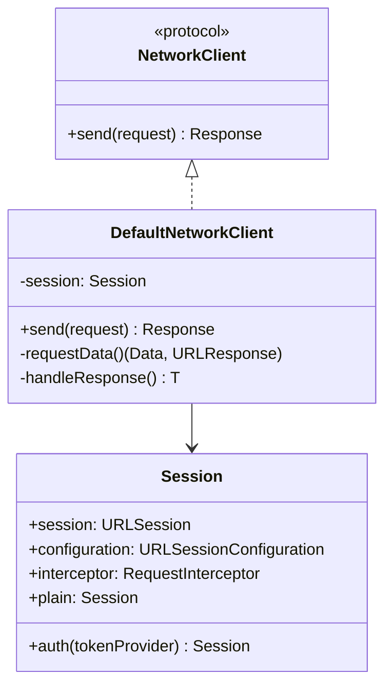

# Client

네트워크 요청을 수행하는 클라이언트

## 파일

| 파일 | 역할 |
|------|------|
| `NetworkClient` | 클라이언트 프로토콜 |
| `DefaultNetworkClient` | 기본 구현체 |
| `Session` | URLSession + Interceptor 조합 |

## 구조

## Session 프리셋

| 프리셋 | 설명 |
|--------|------|
| `.plain` | 기본 헤더 + 재시도 |
| `.auth(tokenProvider:)` | 기본 헤더 + 인증 토큰 + 재시도 |
