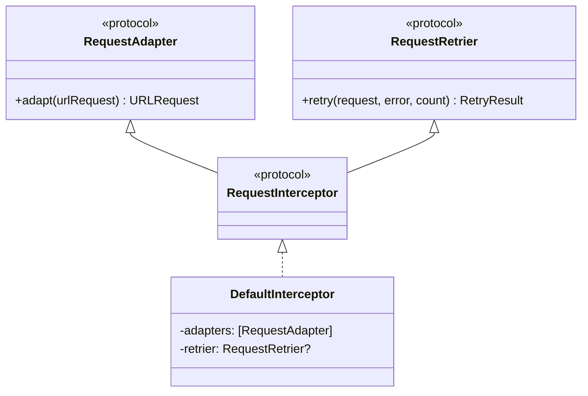

# Interceptor

요청 수정(Adapt) 및 재시도(Retry) 담당

## 파일

| 파일 | 역할 |
|------|------|
| `RequestAdapter` | 요청 수정 프로토콜 |
| `RequestRetrier` | 재시도 프로토콜 + RetryResult |
| `RequestInterceptor` | Adapter + Retrier 통합 |

## 구조

## Adapter 구현체

| 구현체 | 역할 |
|--------|------|
| `HeaderAdapter` | 기본 헤더 추가 |
| `AuthAdapter` | 인증 토큰 추가 |

## RetryResult

| 케이스 | 동작 |
|--------|------|
| `.retry` | 즉시 재시도 |
| `.retryWithDelay(TimeInterval)` | 지연 후 재시도 |
| `.doNotRetry` | 재시도 안 함 |
| `.doNotRetryWithError(Error)` | 에러 전파 |

## DefaultRequestRetrier

- 최대 재시도 횟수: 3회
- 재시도 상태 코드: 408, 429, 500, 502, 503, 504
- 지연 시간: 1초
