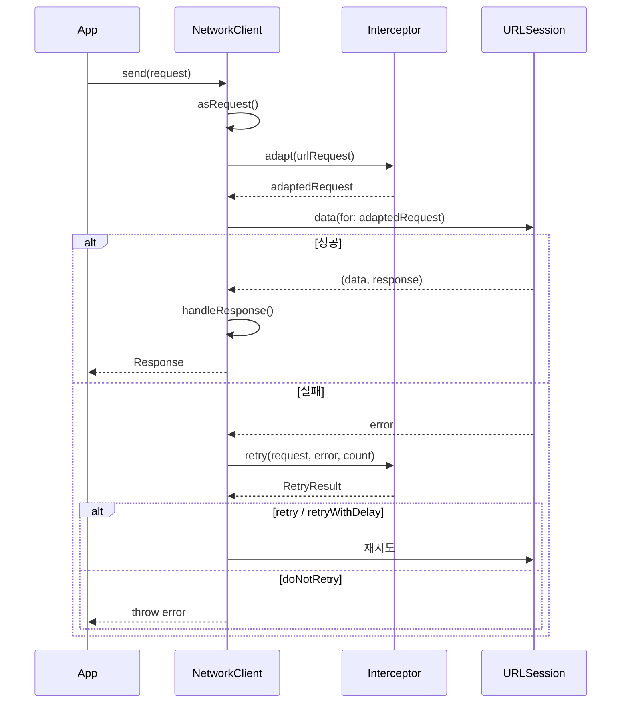

# Network

URLSession 기반 네트워크 모듈

## 구조

```
Network/
├── Client/          # 네트워크 클라이언트
├── Configuration/   # 설정 (BaseURL, 기본 헤더)
├── Error/           # 에러 정의
├── HTTP/            # HTTP 관련 타입
├── Interceptor/     # 요청 수정 및 재시도
└── Request/         # 요청 정의 및 파라미터 인코딩
```

## 흐름도



## 사용 예시

```swift
// 1. Request 정의
struct UserRequest: Request {
    typealias Response = User
    
    var path: String { "/users/1" }
    var method: HTTPMethod { .get }
    var header: [HTTPHeader] { [] }
    var parameter: RequestParameter { .none }
    var timeoutInterval: TimeInterval? { nil }
}

// 2. Client 생성 및 요청
let client = DefaultNetworkClient(session: .plain)
let user = try await client.send(with: UserRequest())
```
