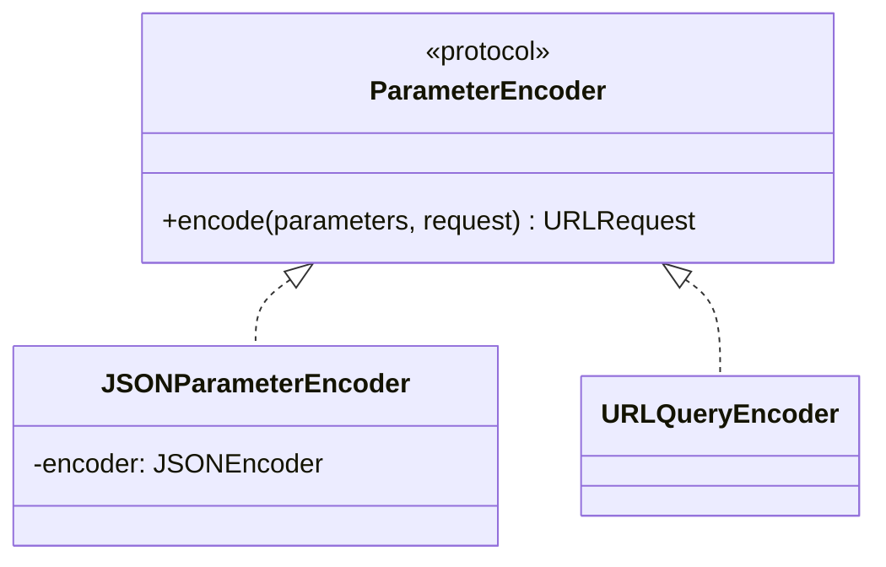

# Request

요청 정의 및 파라미터 인코딩

## 파일

| 파일 | 역할 |
|------|------|
| `Request` | 요청 프로토콜 |
| `RequestParameter` | 파라미터 래퍼 |
| `ParameterEncoder` | 파라미터 인코딩 |

## Request 프로토콜

```swift
protocol Request {
    associatedtype Response: Decodable & Sendable
    
    var header: [HTTPHeader] { get }
    var path: String { get }
    var method: HTTPMethod { get }
    var parameter: RequestParameter { get }
    var timeoutInterval: TimeInterval? { get }
}
```

## RequestParameter

| 타입 | 설명 |
|------|------|
| `.query(_)` | URL 쿼리 파라미터 |
| `.jsonBody(_)` | JSON 바디 |
| `.none` | 파라미터 없음 |

## ParameterEncoder



| 인코더 | 동작 |
|--------|------|
| `JSONParameterEncoder` | httpBody에 JSON 인코딩 |
| `URLQueryEncoder` | URL 쿼리스트링으로 변환 |
